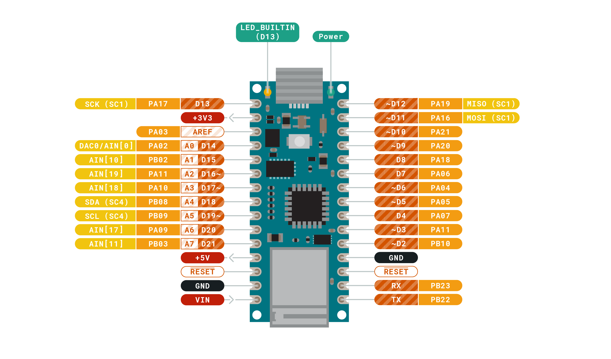

# UUG Arduino Demo - Morse Code

---

# Getting Started

- Split into 4 teams. Half of you will be sending code and the other half will receive the code

- If you are more comfortable coding, go to the sending team

- Designate a person to code and a person to wire the Arduino

---

# Setting up the Arduino IDE

- Go to https://www.arduino.cc/en/main/software and download the Arduino IDE.

- Once the IDE is downloaded, go to Tools > Board > Board Manager > Search "Nano 33" > Install Arduino SAMD

- Now go back to Tools > Board and select Nano 33 IoT

- When you plug in the board, make sure your port is Nano 33. Tools > Port.

---
# Bulding the Receiver Board

- You will be given a Arduino already connected to a breadboard, a cable, a 68 ohm resistor (brown), a LED, and a micro usb cord.

- Follow these next steps exactly or else I will have to go find a fire extinguisher.

---

 1. Plug one end of resister into D2(row 20, column A on breadboard) and one end into row 10, column A, on breadboard.

---

2. Plug the longer side of the LED into row 10, column B, next to the resistor.

3. Plug the cable into row 9, column C, next to the LED and the other end into row 19 next the GND Port (Accented white on the actual Arduino)

---

# Building the Sender Board

- You will be given a Arduino already connected to a breadboard, two cables, a 10k ohm resistor (turquoise), a button, and a micro usb cord.

- Follow these next steps exactly or else I will have to go find a fire extinguisher.

---

 

1. Plug the button into row 5 and 7 across the crease or as Ripley calls it "The Pit of Doom" "Pit of Despair" or "The Canyon". 
"Don't quote me in there" - Ripley

---

2. Plug resistor into row 19, column A, next the GND Port (Accented white on the actual Arduino) and row 5, column A
3. Plug one cable into row 21, column B and row 5, column B next to the resistor
4. On the opposite side, plug your 2nd cable into row 29, column J next to the +3V3 port and row 7, column J.
