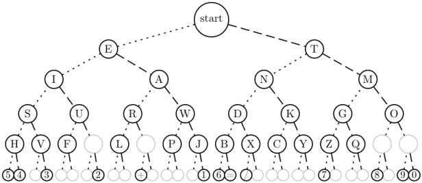

<!-- backgroundColor: black -->
<!-- color: white -->

# UUG Arduino Demo - Morse Code

---

# Getting Started

- Split into 4 teams. Half of you will be sending code and the other half will receive the code but both sides will end up coding.

- If you are more comfortable coding, go to the sending team

- Designate a person to code and a person to code the Arduino

- If you are the person coding, go to www.github.com/nuttercd/ArduinoDemo

---

# Setting up the Arduino IDE

- Go to https://www.arduino.cc/en/main/software and download the Arduino IDE.

- Once the IDE is downloaded, go to Tools > Board > Board Manager > Search "Nano 33" > Install Arduino SAMD

- Now go back to Tools > Board and select Nano 33 IoT

- When you plug in the board, make sure your port is Nano 33. Tools > Port.

---

# Installing Wifi Tools

- Studio > Sketch > Include Library > Manage Library > Search for "wifinina" > Install WifiNINA  

- Search for "pubsubclient" > Install PubSubClient by Nick


---

# What is MQTT

MQTT (MQ Telemetry Transport) is a protocol that defines two types of network entities: a message broker and a number of clients. An MQTT broker is a server that receives all messages from the clients and then routes the messages to the appropriate destination clients. A MQTT client is any device (The Arduinos) that runs an MQTT library and connects to an MQTT broker (The Raspberry Pi) over a network.

---
Clients have their own client IDs. You tell MQTT your name, so it knows what messages the PI have already told you. You could potentially add a new Arudino to connect and get all the old messages.

---

In order to receive messages the Arudinos must subscribe to a "topic" that you have provided the MQTT. To send a message you publish into the topic.

---

# Building the Receiver Board

- You will be given a Arduino already connected to a breadboard, a wire, a 68 ohm resistor (brown), a LED, and a micro usb cord.

- Follow these next steps exactly or else I will have to go find a fire extinguisher.

---


 1. Plug one end of resister into D2(row 20, column A on breadboard) and one end into row 10, column A, on breadboard.

 2. Plug the longer side of the LED into row 10, column B, next to the resistor.

 3. Plug the wire into row 9, column C, next to the LED and the other end into row 19 next the GND Port (Accented white on the actual Arduino)

---

# Building the Sender Board

- You will be given a Arduino already connected to a breadboard, two cables, a 10k ohm resistor (turquoise), a button, and a micro usb cord.

- Again don't mess this up. You will cause a fire, and we don't want fires.

---

 

1. Plug the button into row 5 and 7 across the crease or as Ripley calls it "The Crevice of Doom" "Pit of Despair" or "The Canyon". "Don't quote me in there" - Ripley

2. Plug resistor into row 19, column A, next the GND Port (Accented white on the actual Arduino) and row 5, column A

3. Plug one wire into row 21, column B and row 5, column B next to the resistor

4. On the opposite side, plug your 2nd wire into row 29, column J next to the +3V3 port and row 7, column J.

---

# Demo #1 - Turn LED On/Off (Receive)

Use the LED_test example.

---

<!-- _color: black -->

```C

const int mypin = 2;

void setup() {
  pinMode(mypin, OUTPUT);
}

void loop() {
  digitalWrite(mypin, HIGH);   // turn the LED on (HIGH is the voltage level)
  delay(1000);                       // wait for a second
  digitalWrite(mypin, LOW);    // turn the LED off by making the voltage LOW
  delay(1000);                       // wait for a second
}

```

---

# Demo #2 - Turn the LED On/Off using the button (Send)

 Use the button_test example.

---
<!-- backgroundColor: black -->
<!-- _color: black -->

``` C

const int buttonPin = 3;

int buttonState = 0;

// the setup function runs once when you press reset or power the board
void setup() {
  // initialize digital pin LED_BUILTIN as an output.
  pinMode(LED_BUILTIN, OUTPUT);
  pinMode(buttonPin, INPUT);
}

// the loop function runs over and over again forever
void loop() {
  buttonState = digitalRead(buttonPin);

  // check if the pushbutton is pressed. If it is, the buttonState is HIGH:
  if (buttonState == HIGH) {
    // turn LED on:
    digitalWrite(LED_BUILTIN, HIGH);
    delay(1000);
    digitalWrite(LED_BUILTIN, LOW);
  }
}
```

---

# Demo 3 - Print "Short" and "Long" (Send)

 Use the short_long_button_test example.

---
<!-- backgroundColor: black -->
<!-- _color: black -->

``` C

const int buttonPin = 3;

int buttonState = 0;

int count = 0;

// the setup function runs once when you press reset or power the board
void setup() {
  // initialize digital pin LED_BUILTIN as an output.
  pinMode(LED_BUILTIN, OUTPUT);
  pinMode(buttonPin, INPUT);
  Serial.begin(9600);
}

// the loop function runs over and over again forever
void loop() {
  buttonState = digitalRead(buttonPin);

  // check if the pushbutton is pressed. If it is, the buttonState is HIGH:
  if (buttonState == HIGH) {
    count++;
  }
    else {
      if (count > 25){
        Serial.println("long");
      } else if (count > 1 && count < 25){
        Serial.println("short");
      }
      count = 0;
    }
    delay(10);  
}

```

---

# Demo 4 - Connect to the wireless (Both)

There are two different examples. The send team will use sendWifi and the receive team will use receiveWifi.

---

Now in order to do the next part of the presentation you must go into your code and change your Topic Name. Team 1's topic name is Team1Send, and Team 2's name is ... Team2Send. These have to be shared between teams. The Client Name for Team 1 is Team1Receive and for Team 2 it is Team2Receive.

---

# Your mission if you choose to accept it...

 Send a message using Morse code, but actually send the letters instead of "short" and "long"

---
<!-- backgroundColor: white -->




